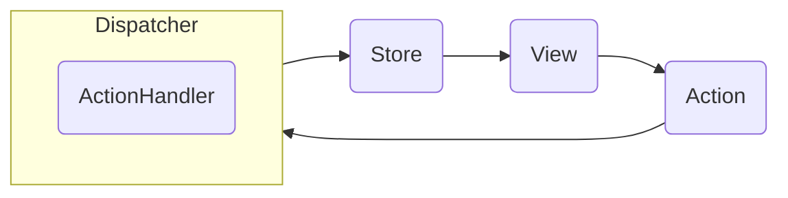

# redux-like

Experiment to explore a state management approach similar to [Redux](https://redux.js.org/), that aims to further simplify data flow, reduce boilerplate, and improve performance and maintainability.

### Data Flow



Although the Redux data flow looks similar, in practice there is often logic in components, middleware, reducers and selectors. The idea is to remove or reduce the need for logic in these areas and instead capture all behavior within pure TypeScript [`ActionHandler`](#actionhandler) functions that are easy to test and maintain.

### ActionHandler

Actions are processed by corresponding `ActionHandler` functions.

```ts
type ActionHandler<T> = (
  action: Action<T>
) =>
  | Action
  | StoreUpdate
  | StoreUpdate[]
  | Promise<Action | StoreUpdate | StoreUpdate[]>
  | Observable<Action | StoreUpdate | StoreUpdate[]>
  | void;
```

`ActionHandler` takes an `Action` as argument and returns further child `Action` or various forms of `StoreUpdate` which is essentially just a key value pair representing an update to the [store](#store).

The return type also supports `Promise` and `Observable` types allowing an `ActionHandler` to support asynchronous operations without middleware. `void` is also allowed as a `ActionHandler` may not update the [store](#store).

### Store

Store is implemented as a `Map` of `Observable` values.

```ts
type Store = {
  ...
  get<T>(key: StoreKey<T>): T | undefined;
  get$<T>(key: StoreKey<T>): Observable<T>;
  set(value: T): StoreValue<T>;
  ...
};
```

Using a `Map` improves performance by reducing copying and traversal of nested objects.

Reducers are no longer needed to update the store, as a `Map` store can be generically updated by the Dispatcher given a `StoreUpdate`. Similarly, there is no longer a need for selectors to extract values from a nested object store.

Exposing values as an `Observable` enables stream level operations such as debounce to be easily performed.

### Connect

`connect` is similar to the React Redux [connect](https://react-redux.js.org/api/connect) and connects the `Observable` store and values to components.

```tsx
const connect =
  <T extends {}, P extends {}>(
    Component: FC<T & P>,
    contextProps: PropCreator<T, P>
  ): FC<P> => ...
```

It allows function components to access state through props easily, without the need for hooks. Hooks can often encourage code that couples state, logic, and effects with components, which reduces maintainability.

`PropCreator` enables props to be created with the following function signature which provides helper store getters and dispatch functions.

```ts
(props: P) => ({ get, get$, dispatch, ... }) => {...}
```

### Toolkit

Similar to [Redux Toolkit](https://redux-toolkit.js.org/), `toolkit.ts` provides helper functions to simplify the workflow. `createSlice` takes in `storeKeys`, `actionHandlers` and returns typesafe keys and actions.

```ts
const { keys, actions, ... } = createSlice(
  {
    keys: {
      path: {
        key: init(123),
      }
      ...
    },
    actions: {
      action: (payload: number) => ({ get, get$, set, dispatch, ... }) => {...}
      ...
    }
  }
)
```

This will generate a typesafe `` StoreKey<number,`path/key`> `` and set that key in the store to `123`, a generate typesafe `` Action<number, `action`> `` and `` ActionHandler<number, `action`> ``.
